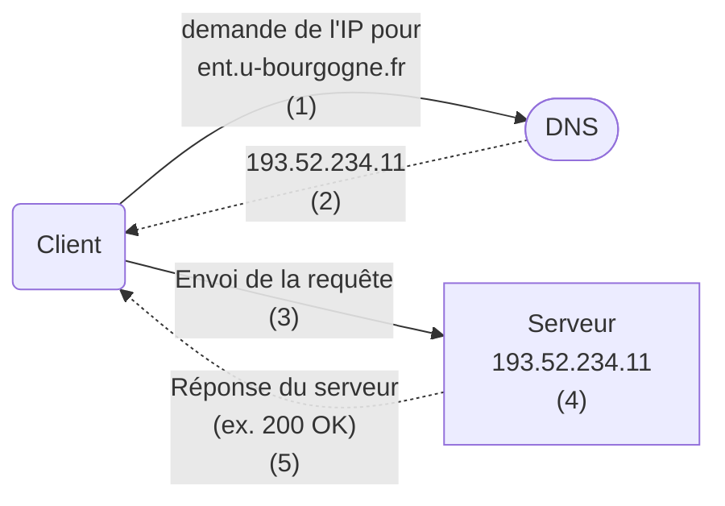

# Communications HTTP/S - RAPPEL

Dans la majorité des cas, les échanges HTTP/S se réalisent comme suit:



1. Initiation par le client.
2. Résolution DNS: Le nom de domaine (ex. ent.u-bourgogne.fr) est traduit en adresse IP par DNS.
3. Transmission de la requête.
4. Traitement de la requête par le serveur.
5. Réponse du serveur.

## Erreurs HTTP

Les erreurs, lors d'un échange HTTP/S, sont représentées par **un code** et un message. Le code HTTP/S est une code à trois chiffres accompagnés d'un court texte qui nous fournit déjà énormement d'informations sur la source de l'erreur ou du comportement. Dès le premier chiffre, on observe:

* `1xx`: Information – Indique un processus en cours.
* `2xx`: Succès – La requête a réussi (ex. `200 OK`, `204 No Content`).
* `3xx`: Redirection – La ressource demandée a été déplacée (ex. `301 Moved Permanently`).
* `4xx`: Erreur du client – La requête est incorrecte (ex. `404 Not Found`).
* `5xx`: Erreur du serveur – Le serveur a rencontré une erreur (ex. `500 Internal Server Error`).

```shell
❯ curl -v ent.u-bourgogne.fr
* Host ent.u-bourgogne.fr:80 was resolved.
* IPv6: (none)
* IPv4: 193.52.234.11
*   Trying 193.52.234.11:80...
* Connected to ent.u-bourgogne.fr (193.52.234.11) port 80
> GET / HTTP/1.1
> Host: ent.u-bourgogne.fr
> User-Agent: curl/8.7.1
> Accept: */*
>
* Request completely sent off
< HTTP/1.1 302 Found
< content-length: 0
< location: https://ent.u-bourgogne.fr/
< cache-control: no-cache
```

Besoin de vous faire une idée des différents codes ? [Voici quelques illustrations, pertinentes. 🐶](https://http.dog/)

## Méthodes HTTPs (verbe REST)

Les verbes REST (aussi appelés méthodes HTTP) sont utilisés dans les requêtes HTTP pour indiquer l'opération que le client souhaite effectuer sur l'API (récupérer des données, les créer, les modifier ou les supprimer). 

```text
GET: Lire une ressource.
POST: Créer une ressource.
PUT: Mettre à jour ou remplacer une ressource.
PATCH: Mettre à jour partiellement une ressource.
DELETE: Supprimer une ressource.
```

## L'outil `curl`

`curl` (pour Client URL) est un outil en ligne de commande qui permet d'envoyer des requêtes à un serveur. Il prend en charge plusieurs protocoles de transfert (HTTP, HTTPS, FTP, FTPS, etc) et peut être utilisé pour tester les API, télécharger des fichiers, et vérifier le comportement des requêtes réseau.

```shell
curl http://example.com                               # Envoi une requête GET sur http://example.com
curl -X POST http://example.com                       # Envoi une requête POST sur http://example.com
```

Envoyer des informations dans les requêtes (en texte brut ou en JSON):

```shell
curl -X POST -d "param1=value1&param2=value2" http://example.com/resource  
curl -X POST -H "Content-Type: application/json" -d '{"key1":"value1", "key2":"value2"}' http://example.com/api
```

Plus de détails sur la communication avec l'option `-v`.

Plus d'information sur `curl`: `man curl` ou [curl](https://curl.se/docs/manpage.html).

## Le S de HTTPS

HTTP**S** est une version sécurisée d'HTTP, qui utilise un chiffrement pour protéger les communications entre le client et le serveur.
On distingue deux types de protocole, SSL (Secure Sockets Layer) et TLS (Transport Layer Security).

[La négociation et le chiffrement se réalise en utilisant des certificats, côté le client et côté serveur.](https://www.cloudflare.com/fr-fr/learning/ssl/what-is-ssl/#:~:text=SSL%2C%20ou%20Secure%20Sockets%20Layer,donn%C3%A9es%20dans%20les%20communications%20Internet.)

> [!important]
> Nous ne mettrons pas en place de communication HTTP **S**écurisé via certificat durant les TDs ou le projet.
>
> Dans le cas d'erreur SSL, lorsque vous essayez d'accéder à votre frontend via votre navigateur, vérifiez le protocol utilisé.
