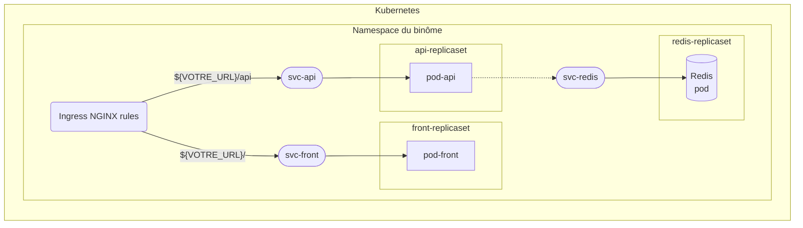

[](https://u-bourgogne.fr/) | Polytech Dijon - 4A - FISA <br/> Cloud computing <br/><br/> **[ EXAMEN PRATIQUE ]** | [](https://esirem.u-bourgogne.fr/)
:--- | :---: | ---:
|| À rendre au plus tard le `30 Janvier 2026 à 23h59` ||

Sommaire
---

* [Sujet du projet](#sujet-du-projet)
* [Exigences projet](#exigences-pour-le-projet)

---

Le projet noté du module de Cloud computing évaluera compétences et bonnes pratiques de développement vues en cours. La notation tiendra compte des fonctionnalités déployées dans l’API, de la bonne mise en place des points d’exigences projets, de votre compréhension de votre code ainsi que de la collaboration entre les membres du groupe.

---

# Sujet du projet

[](https://x.com)

<br/>

Au cours de ce projet nous allons réaliser les différentes composantes microservices permettant de refaire le SaaS **X ( ancien Twitter )** ☝️

## Déroulé du projet

### Faire place net

Utilisez le dépôt de TD. ( vous pouvez le renommer si besoin )
Déplacez votre travail de TD ( fichiers, dossiers et README.md ) dans un dossier du même nom à la racine du dépôt.

Créez un nouveau README.md à la racine du projet qui servira de rapport pour le projet avec pour l’instant membres du groupe.

Vous viendrez l’agrémenter avec le déroulé du projet, les technologies utilisées, des badges, des badges de résultats de l'exécution des CIs et la procédure pour exécuter les composantes du projet.

Vous organiserez votre dépôt GitHub avec deux dossiers à la racine du projet à côté du README principal:

* un pour le `frontend` pour le code de l'interface utilisateur.
* un pour le `backend`, pour le code de votre API.

Chacun d’eux contenant un **README** spécifique et un **Dockerfile** permettant de lancer les programmes dans des conteneurs.

---

### API 🚀

L'API c'est le cerveau de votre SaaS, une interface programmable qui permet de réaliser des traitements. Les requêtes envoyé à l'API sont traiter et de l'information est retourné pour informer ou répondre à la demande l'utilisateur. Que ce soit via un outil comme `curl` ou caché dans les fonctions javascript d'un `frontend`, l'envoie de requête à l'API permet de commander des traitements pour utiliser ses fonctionnalités.

Concevoir une API simple ( `Python/Flask`, `Node` ou `Rust` ). Elle permettra de répondre aux fonctionnalités suivantes :

* Twetter.
* Afficher tous les tweets.
* Enregistrer les tweets dans Redis.
* Afficher les tweets liés à une personne.
* Retweeter.
* *Facultatif -* Afficher les sujets.
* *Facultatif -* Afficher les tweets liés à un sujet.

Via la déclaration de route `GET` et `POST` vous définirez les fonctions pour répondre aux fonctionnalités si dessus ☝️

#### Gestion des hashtags

Gérer les sujets peut se faire en créant une clé dédiée au sujet dans le dictionnaire des utilisateurs.

*Par exemple* : Vous pouvez utiliser des un préfix pour éviter les conflits de clé. Par exemple, les utilisateurs auront une clé au format `u-username` et les sujets `h-hashtag`.

> [!TIP]
> Pour trier les liens entre sujets, utilisateurs et tweets tout se fera au traitement de la requête.

ℹ️ vous pouvez utilisez un autre format, votre choix est à préciser dans le readme.

#### Gestion des objets

L'envoie et le retour de données dans les requêtes et les reponses `HTTP` peut être simplifié via l'utilisation de structure [`JSON`](https://fr.wikipedia.org/wiki/JavaScript_Object_Notation). Vous pourrez gérer vos traitements et/ou transformation de donnée ou de message dans les routes de votre API.

> [!TIP]
> Avant de mettre en place les bases Redis, vous pouvez utiliser des dictionnaires pour tester vos routes et vos fonctionnalités.

Testez vos routes avec la commande `curl`.

---

### Redis

Pour externaliser le stockage des données et garantir leurs concervations en cas redémarrage de l'API, le tout dans une base rapide et sans contrainte vous utiliserez `redis`.

#### Qu'est ce que Redis ?

`Redis` est une base de donnée clé/valeur qui vous permettra de stocker de la donnée sous forme de dictionnaire.

Vous utiliserez Redis comme serveur de données, lancé dans un conteneur sur votre machine. Accessible une fois lancer via `localhost` sur le port `6379`.

Dans un autre terminal vous pouvez lancer `redis` frontalement via la commande :

```bash
docker run --name myredis --rm -p 6379:6379 redis
```

> Tips : utilisez l'outil `redis-cli` pour accéder à `redis` directement sans script `python`.

Si vous stockiez vos tweets dans une variable dictionnaire vous pouvez maintenant la remplacer par un stockage dans le serveur `redis`.

#### Stocker les tweets via Redis

Vous stockerez les messages dans deux bases Redis.

Une base contenant les tweets.

*exemple :* `key=timestamp, value=’{“author”: “username”, “tweet”: ”message”}’`

Une base contenant les utilisateurs dans laquelle la clé sera le nom d’utilisateur et en valeur la liste des clés de ses tweets.

*exemple :* `key=username, value=[timestamp_1, timestamp_2, timestamp_3]`

L'architecture ci-dessus est un exemple. Vous êtes libre de choisir une autre architecture, mais elle doit fonctionner 😉

---

### Tout est dans le détail 🧐

Il ne manque plus que l’interface utilisateur !

Avec la technologie de votre choix ( `HTML/CSS/JS`, `Node`, `VueJS`, `React`… ) réalisé un `frontend` pour communiquer avec votre API. Via boutons et formulaires, il permettra d’appeler les différentes routes de votre API et de mettre en forme leurs retours.

Laissez libre court à vos envies et votre imagination pour designer votre Twitter, la forme importe peu mais elle devrait **couvrir toutes fonctionnalités de l’API** décrite dans la section [API 🚀](#api-🚀)

ℹ️ N’oubliez pas le **Dockerfile** pour permettre le lancement du frontend dans un conteneur.

> [!tip]
> Pas de nécessité à faire un frontend exceptionnel, seul le fait de pouvoir utiliser les fonctionnalités sera évalué.

> [!NOTE]
> Documentations pour la section:
>  [Documentation Flask](https://flask.palletsprojects.com/en/3.0.x/)
> **-** [Documentation Docker](https://docs.docker.com/)
> **-** [Documentation Redis](https://redis.io/docs/latest/)
> **-** [RAPPEL Docker](/docs/rappel-docker.md)
> **-** [RAPPEL GitHub & Readme](/docs/rappel-github.md)
> **-** [RAPPEL HTTP/S et API](/docs/rappel-http.md)
> **-** [RAPPEL DNS](/docs/rappel-dns.md)

---

# Kubernetes

[](https://kubernetes.io/docs/home/)

Utilisez Kubernetes pour déployer votre application au sein d'un namespace `nombinome1-nombinome2`.

1. Pour chaque *microservice*, déclarez un [ReplicaSet](https://kubernetes.io/docs/concepts/workloads/controllers/replicaset/) et un [Service](https://kubernetes.io/fr/docs/concepts/services-networking/service/) pour exposer le conteneur de ce dernier.
2. Passer en variable environnement les variables permettant la connexion entre les services qui doivent l'être.
3. Veillez à avoir dans vos [ReplicaSet](https://kubernetes.io/docs/concepts/workloads/controllers/replicaset/) les paramêtres suivants au niveau du conteneur.
    ```yaml
    # ...
    resources:
      requests:
        cpu: "4m"
        memory: "32Mi"
    ```
4. Exposer le service frontend et le backend via une règle [Ingress](https://kubernetes.io/docs/concepts/services-networking/ingress/) pour le nom de domaine défini dans la section [Fondation](#fondation).

> [!caution]
> **Vous n'avez pas besion de déployer d'Ingress Controller !** Il est déjà présent au sein du cluster.
>
> Créer uniquement un objet de `kind: Ingress` pour lequel l'attribut `ingressClassName` vaut `nginx`.

Une fois la configuration déployée, accéder à votre nom de domaine via un navigateur doit vous permettre d'utiliser twitter.



**Les liens en pointillés ne sont pas à décrire de façon explicite dans la configuration Kubernetes, mais seront à coder dans les applications.**

Cette section est terminée si vous accédez à votre application en utilisant l'URL `twitter-<nombinome1>-<nombinome2>.polytech-dijon.kiowy.net` dans votre navigateur.

> [!important]
> Il n'y a pas de DNS configuré pour cet environment, utilisez votre DNS local pour que `twitter-<nombinome1>-<nombinome2>.polytech-dijon.kiowy.net` resolve `34.140.190.146`.
> `/etc/hosts` (linux) ou `C:/Windows/system32/drivers/etc/hosts` (windows)
> ```
> # ...
> 34.140.190.146   twitter-<nombinome1>-<nombinome2>.polytech-dijon.kiowy.net
> ```

> [!NOTE]
> Documentations pour la section:
> [Kubernetes](https://kubernetes.io/docs/home/)
> **-** [K8S Pod](https://kubernetes.io/docs/concepts/workloads/pods/)
> **-**  [K8S Service](https://kubernetes.io/fr/docs/concepts/services-networking/service/)
> **-**  [K8S ReplicaSet](https://kubernetes.io/docs/concepts/workloads/controllers/replicaset/)
> **-**  [K8S Deployment](https://kubernetes.io/docs/concepts/workloads/controllers/deployment/)
> **-**  [K8S Namespace](https://kubernetes.io/docs/concepts/overview/working-with-objects/namespaces/)
> **-** [K8S Ingress](https://kubernetes.io/docs/concepts/services-networking/ingress/)
> **-**  [kubectl Cheat Sheet](https://kubernetes.io/fr/docs/reference/kubectl/cheatsheet/)

---

## Exigences pour le projet

Ce projet à rendre au plus tard le `30 Janvier 2026 à 23h59`.

> [!WARNING]
> À partir de cette date, aucune modification du dépôt ou de code ne sera prise en compte.

### GitHub

Vous rendrez votre code via un dépôt GitHub, auquel vous m’aurez ajouté en tant que collaborateur.

* L’historique des changements sur le dépôt devra montrer la collaboration entre les membres du groupe ( changement de sources différentes sur les fichiers projet ).
* Le dépôt devra être documenté via au moins 1 README : informations sur le `frontend`, le `backend` et comment utiliser et déployer le projet.
* Ce README contiendra les noms des **membres du groupe**, le **déroulé du projet**, les **technologies utilisées**, des **badges**, des badges de **résultats de l'exécution des CIs**, la **procédure** pour exécuter les composantes du projet ainsi qu'un schéma de votre architecture microservice.

### Docker

* Un Dockerfile pour construire l'API (`backend`).
* Un Dockerfile pour construire le `frontend` si vous utilisez `Node`, `React` ou `VueJs`.
> [!tip]
> Si vous utilisez du `HTML/CSS/JS` utilisez un Dockerfile `nginx`.
* *Bonus -* un fichier `docker-compose.yaml` pour lancer l'ensemble de ces conteneurs localement.

### Redis

* Décrire la structure de donnée utilisée dans le **README**.
* Créez un script `python` pour charger dans la base de donnée `redis` des tweets et des utilisateurs par défaut. Ce script permettra d'avoir une base pour tester l'interface utilisateur.
