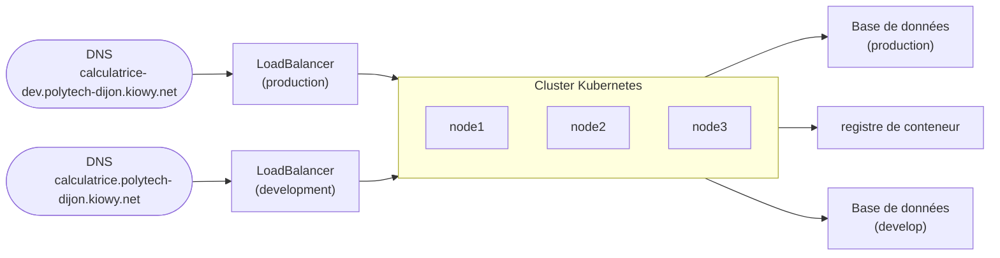
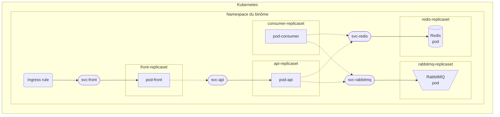

# [](https://esirem.u-bourgogne.fr/)
# EXAMEN PRATIQUE - ILIA-SQR - Virtualisation & Cloud Computing

> [!WARNING]
> À rendre au plus tard le `16 décembre 2024 à 23h59`

Sommaire
---

* [Sujet du projet](#sujet-du-projet)
* [Fondation](#fondation)
* [Environnement](#environnement-logiciel)
* [Application](#application)
* [Exigences projet](/docs/exigences-projet.md)

---

Le projet noté du module de Virtualisation & Cloud computing évaluera compétences et bonnes pratiques de développement vues en cours. La notation tiendra compte de l'infrastructure déployée, des fonctionnalités déployées dans l'application, de la bonne mise en place des points d’exigences projets, de votre compréhension de votre code ainsi que de la collaboration entre les membres du groupe.

---

# Sujet du projet

Vous allez réaliser une **Calculatrice Cloud Native**.

De la déclaration des ressources d'infrastructure, à l'implémentation des composants logiciels de l'application tout en passant par la configuration de l'environnement.

## Déroulé du projet

Ce projet va se dérouler comme la mise sur le marché d'une application.

À l'image de l'équipe tech d'une startup, vous allez deployer une application pour la mettre à disposition d'utilisateurs.
Vous passerez donc par la conception et le provisionnement d'une infratructre à la déclaration des fichiers de déploiement
pour déployer sans oublier la conception de l'application.

Pour marcher sur les traces du Cloud Natif, nous allons mettre en place de bonnes pratiques dès le départ :

* **L'infrastructure de base** sera définie en code (IaC) via `Terraform`.
* **La configuration et l'architecture de déploiment** sera faite via `Kubernetes`.
* **L'application** sera architecturée d'un point de vue logique comme une grappe de microservices:

  ```mermaid
  graph TB;
      A(Utilisateur) --> B[Frontend]
      B -->|"Envoi du calcul
              ou
              Demande d'un résultat"| C[API]
      C -->|Transmission du calcul à faire | E[\RabbitMQ/]
      -.->
      F(["Consumer
          ( calcul )"]) -->|Récupèration d'un calcul| E
      F -->|Stockage du résultat| D
      C <-->|Accès aux résultats| D[(Redis)]
  ```

### Faire place nette

Utilisez votre dépôt utilisé en TD.
Déplacez votre travail de TD ( fichiers, dossiers et `README.md` ) dans un dossier du même nom à la racine du dépôt.

Créez un nouveau `README.md` à la racine du projet qui servira de rapport pour le projet (pour l’instant vous pouvez y saisir les membres du groupe).

Créez les dossiers `foundation`, `kubernetes` et `application`, qui serviront à stocker respectivement, les fichiers **Terraform**, **Kubernetes** et **les fichiers de l'application** à déployer.

> Chacun de ces dossiers contiendra un `README.md` dédié.

Dans le dossier `application`, vous organiserez le contenu en trois dossiers:

* un pour le `frontend` pour le code de l'interface utilisateur.
* un pour le `backend`, pour le code de votre API.
* un pour le `consumer`, pour le code de votre consommateur de message.

Le fichier `application/README.md` contiendra également les commandes nécéssaires pour contruire les images de conteneur du projet ainsi que celles pour en pousser une version dans **Google Artifact Registry**.

## C'est parti ! 🚀 À partir d'ici, chaque section peut être réalisée indépendement.

---
## Fondation

[](https://developer.hashicorp.com/terraform/docs)
[](https://registry.terraform.io/providers/scaleway/scaleway/latest/docs)

Qui dit "projet" dit aussi "contraintes supplémentaires" ! Nous voulons une calculatrice qui soit hébergée en France **et** par un fournisseur français. 🐓

```hcl
terraform {
  required_providers {
    scaleway = {
      source = "scaleway/scaleway"
    }
  }
  required_version = ">= 0.13"
}
```

En utilisant le provider Terraform de [Scaleway](https://registry.terraform.io/providers/scaleway/scaleway/latest/docs), fournisseur de Cloud français, décrivez l'infrastructure as code:

* Un **registre** de conteneur.
* Un cluster **Kubernetes**.
* Une base de données de `development` et de `production`.
* Une **entrée DNS** pour `calculatrice-<nombinome1>-<nombinome2>-polytech-dijon.kiowy.net` pour résoudre l'IP d'un des **LoadBalancers**.
* Une **entrée DNS** pour `calculatrice-dev-<nombinome1>-<nombinome2>-polytech-dijon.kiowy.net` pour résoudre l'IP d'une des **LoadBalancers**.
* Un **LoadBalancer** de `development` et un **LoadBalancer** de `production`.

> Stocker les fichiers dans le dossier `foundation`



**Vous devez utiliser des variables** pour nommer les ressources dédiées à un environment selon les environments.

> [!TIP]
> Ce qui veut dire que les fichiers ne contiendrons qu'une instance de chaque type de ressource
> (une pour le registre, une pour le cluster, une pour **les** bases de données, une pour **les** entrées DNS et une pour **les** LoadBalancers).

Cette section est terminée si les commandes `terraform fmt`, `terraform validate` et `terraform plan` s'exécutent sans erreur dans le dossier `foundation`.

> [!important]
> Le résultat du terraform plan est à ajouter au README.md de ce même dossier.

> [!NOTE]
> [Documentation Terraform](https://developer.hashicorp.com/terraform/docs) **-** [Documentation Scaleway Terraform](https://registry.terraform.io/providers/scaleway/scaleway/latest/docs) **-** [Documentation Scaleway](https://www.scaleway.com/en/docs/)

## Environnement logiciel

[](https://kubernetes.io/docs/home/)

Utilisez Kubernetes pour déployer votre application au sein d'un namespace `nombinome1-nombinome2`.

1. Pour chaque *microservice*, déclarez un [ReplicaSet](https://kubernetes.io/docs/concepts/workloads/controllers/replicaset/) et un [Service](https://kubernetes.io/fr/docs/concepts/services-networking/service/) pour exposer le conteneur de ce dernier.
2. Passer en variable environnement les variables permettant la connexion entre les services qui doivent l'être.
3. Exposer le service frontend via une règle [Ingress](https://kubernetes.io/docs/concepts/services-networking/ingress/) pour le nom de domaine défini dans la section [Fondation](#fondation).

Une fois la configuration déployée, accéder à votre nom de domaine via un navigateur doit vous permettre d'utiliser la calculatrice.

**Schema récapitulatif**



**Les liens en pointillés ne sont pas à décrire de façon explicite dans la configuration Kubernetes, mais seront à coder dans les applications.**

Cette section est terminée si vous accédez à votre application en utilisant l'URL `calculatrice-<nombinome1>-<nombinome2>-polytech-dijon.kiowy.net` dans votre navigateur.

> [!NOTE]
> Documentations pour la section:
> [Kubernetes](https://kubernetes.io/docs/home/)
> **-** [K8S Pod](https://kubernetes.io/docs/concepts/workloads/pods/)
> **-**  [K8S Service](https://kubernetes.io/fr/docs/concepts/services-networking/service/)
> **-**  [K8S ReplicaSet](https://kubernetes.io/docs/concepts/workloads/controllers/replicaset/)
> **-**  [K8S Deployment](https://kubernetes.io/docs/concepts/workloads/controllers/deployment/)
> **-**  [K8S Namespace](https://kubernetes.io/docs/concepts/overview/working-with-objects/namespaces/)
> **-** [K8S Ingress](https://kubernetes.io/docs/concepts/services-networking/ingress/)
> **-**  [kubectl Cheat Sheet](https://kubernetes.io/fr/docs/reference/kubectl/cheatsheet/)

## Application

Concevoir une API simple.

La calculatrice doit permettre les **additions**, les **soustractions**, les **multiplications** et les **divisions**.

Pour demander ces calculs :

* `POST` &nbsp;: Envoyer un tuple pour demander un calcul. *( Renvoie l'`id` de l'opération )*
* `GET`  &emsp;: Récupérer un résultat à partir un `id`. *( Renvoie le résultat du calcul )*

Pour vos tests, vous pouvez stocker les résultats dans une variable dictionnaire.

> [!TIP]
> Bonne pratique : pour plus de clarté, utilisez un préfix pour vos routes api.
> **exemple :**`/api/ma_route` ou `/v1/ma_route` pour le versionning des endpoints.

Utilisez `curl` pour demander des calculs et récupérer le résultat. [Rappel HTTP/S et API](/docs/rappel-http.md)

```bash
# Rappel
curl -X POST/GET -h localhost:PORT -d "tuple={}"
```

### Externaliser la donnée ( car l'API peut tomber 😱 )

Et que ce soit par contrainte produit ou *par goût de la chose bien faite* :
on va éviter de perdre toutes les demandes de calcul en cours pour un calcul impossible !

Utilisons [Redis](https://redis.io/docs/about/) comme Redis externe à l'API pour la gestion des résultats.

#### Redis

Utilisez Redis comme serveur de données, c’est un système de stockage **clé/valeur** qui utilise le port **6379** pour communiquer. Vous pouvez le lancer dans un conteneur via la commande suivante :

```bash
# À exécuter dans un autre terminal.
docker run -p 6379:6379 --name myredis --rm redis
```

Oui, on pourrait utiliser `-d` pour lancer le conteneur en mode `detached` mais dans un terminal on peut voir les logs, pratique pour débuguer ! 🧐

> [!tip]
> Utilisez [redis-cli](https://redis.io/docs/ui/cli/) pour accéder à `redis` via les commandes `set`, `get`, `keys`.

#### Mise en place de la connexion Redis dans l'API

Connectons maintenant l’API à la Redis
Documentation 👉 [python et redis](https://pypi.org/project/redis/)

```python
import redis
r = redis.Redis(host='localhost', port=6379, db=0)

# Ajout de variable
r.set('foo', 'bar')                 # Retourne True si réussite

# Lecture de 
r.get('foo')                        # Retourne la value de foo
```

Remplacer le système de stockage des opérations et des résultats (précédemment en variable) par un stockage via **Redis**

> Utilisez `curl` pour demander des calculs et récupérer le résultat.

### Gérer les calculs avec des files d'attente

[](https://rabbitmq.com/)

Via un nouveau conteneur, démarrez [**RabbitMQ**](https://rabbitmq.com/) qui servira de serveur de files.

```bash
docker run -it --rm --name rabbitmq -p 5672:5672 -p 15672:15672 rabbitmq:3.12-management
```

> [tip]
> Si vous n'avez pas eu l'occasion d'essayer lors du TD sur la conteneurisation, Tester RabbitMQ avec le tutoriel suivant ! 👉 [ RabbitMQ Hello World ](https://rabbitmq.com/tutorials/tutorial-one-python.html)

Comment la file d'attente doit être ajoutée à l'API: chaque fois que l'API reçoit le calcul à effectuer, elle crée un message avec opérateur et opérandes et le place dans la queue.
**Un autre programme est donc à développer**, il sera chargé de consommer les messages. Pour chaque message, il réalisera le calcul et le stokera le resultat dans le redis.

### Implémenter une interface utilisateur (Frontend)

Ça vous dit un peu de design et d’implémentation d’interface ?

**Une seule consigne :**
Créer un frontend qui permet à l’utilisateur de saisir et d’envoyer des demandes de calcul à l’API ou de récupérer des résultats.

### Dockerization

[](https://docs.docker.com/)

Conteneurisez les microservices `backend`, `frontend` et `consumer`.

### Exemple de fonctionnement pour demander la réalisation une addition - TODO

### Exemple de fonctionnement pour demander le résultat une addition - TODO

> [!NOTE]
> Documentations pour la section:
>  [Documentation Flask](https://flask.palletsprojects.com/en/3.0.x/)
> **-** [Documentation Docker](https://docs.docker.com/)
> **-** [Documentation Redis](https://redis.io/docs/latest/)
> **-** [Documentation RabbitMQ](https://www.rabbitmq.com/docs)
> **-** [RAPPEL Docker](/docs/rappel-docker.md)
> **-** [RAPPEL GitHub & Readme](/docs/rappel-github.md)
> **-** [RAPPEL HTTP/S et API](/docs/rappel-http.md)
> **-** [RAPPEL Docker](/docs/rappel-docker.md)

---

## Exigences pour le projet

Ce projet à rendre au plus tard le `16 décembre 2024 à 23h59`.

> [!WARNING]
> À partir de cette date, aucune modification de votre dépôt ou de son code ne sera prise en compte.

### GitHub

Vous rendrez votre code via un dépôt GitHub, auquel vous m’aurez ajouté en tant que collaborateur.

* L’historique des changements sur le dépôt devra montrer la collaboration entre les membres du groupe ( changement de sources différentes sur les fichiers du projet ).
* Le dépôt devra être documenté de 4 READMEs :
  * un pour les fondations du projet.
  * un pour la configuration Kubernetes.
  * un pour l'application microservice.
  * un global à la racine du dépôt.
* Le README principal contiendra **au minimum** les noms des **membres du groupe**, des détails sur le **déroulé du projet** et ce qui a été implémenté ainsi que des **schémas de votre infrastructure et architecture globale**.

> [!important]
> Vos READMEs jouent le rôle de **rapport de projet**, ajoutez y toutes les informations possibles sur celui-ci.

### Fondation

* Les fichiers `.tf` permettant la déclaration des éléments de fondations doivent être valides syntaxiquement.
* Le `README.md` du dossier `foundation` doit contenir un schema descriptif des fondations avec les noms de vos ressources.
* Le `README.md` du dossier `foundation` doit contenir le résultat de la commande `terraform plan`.

### Kubernetes

* Le dossier `kubernetes` doit contenir les manifestes `.yaml` permettant la déclaration de la configuration de votre environnement.
* Vos manifestes doivent être déployés sans erreur sur le cluster de rendu.
* Un schema descriptif des configuration doit être présent dans le `README.md` du dossier `kubernetes`.

### Application

#### Docker

* Avoir un Dockerfile pour construire l'API (`backend`).
* Avoir un Dockerfile pour construire le `frontend` si vous utilisez `Node`, `React` ou `VueJs`.
* Avoir un Dockerfile pour construire le conteneur du consommateur de message.

> [!TIP]
> Si vous utilisez du `HTML/CSS/JS` utilisez un Dockerfile `nginx`.

#### Redis

* Décrire dans le **README de l'application** la structure de donnée utilisée pour stocker les calculs.

#### Interface utilisateur

* L'interface utilisateur doit permettre de demander la réalisation d'un calcul.
* L'interface utilisateur doit permettre de récupérer le résultat d'un calcul.

#### API backend

* L'API doit permettre d'effectuer les quatre opérations de base.
* L'API doit permettre d'effectuer le stockage et la récupération des calculs dans `redis`.
* L'API doit permettre d'effectuer la mise en file d'attente des demandes de calcul.
