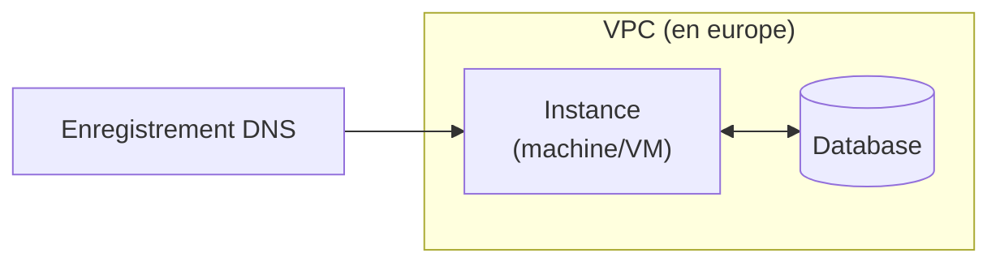

# Provisioner via Terraform

[](https://developer.hashicorp.com/terraform/docs)

Dans ce TD, nous allons mettre en place une infrastructure Cloud via [Terraform](https://developer.hashicorp.com/terraform/docs).

> [!tip]
> Retrouver toutes les informations sur les commandes de base dans le [rappel sur Terraform](../docs/rappel-terraform.md).

## Manipuler Terraform

Créer dans votre de dépôt de code, dans votre dossier `TD`, un dossier `2_terraform` dans lequel vous placerez les fichiers issues de cet exercice **ainsi qu'un `README.md` contenant les résultats de vos `terraform plan`.**

### En utilisant GCP

Dans un dossier `foundation-gcp`, en utilisant GCP et Terraform, créer une IaC pour mettre en place l'infrastructure suivante.



La relation entre VM et la base de donnée se fera dans l'application, pas de besoin donc de la spécifier dans la IaC.
Les deux resources doivent cependant tout de même faire partie du même VPC, pour pouvoir communiquer.

Utiliser [la documentation du provider](https://registry.terraform.io/providers/hashicorp/google/latest/docs) pour choisir et configurer **au minimum** les ressources :

> [!important]
> A chacune des étapes ci-dessous, la commande `terraform validate` & `terraform plan` doit s'executer sans erreur.
> Une fois toutes les étapes réalisé, copier/coller le résultat du `terraform plan` dans votre `README.md`.

1. Commencer par configurer un VPC (`google_compute_network`).
2. Ajouter ensuite une instance de Compute Engine dans ce VPC (`google_compute_instance`).
3. Également dans ce VPC, ajouter une base de donnée. (`google_sql_database_instance`).
4. Ajouter une entrer DNS (`google_dns_record_set`).
5. Ajouter un meta-argument pour permettre de déployer plusieurs instances de la VM pour atteindre le premier chiffre de la haute disponibilité.

> [!tip]
> `google_dns_record_set` nécessite une `managed_zone` utiliser un DNS de votre choix (ex: `example.com`) ou la ressource `google_dns_managed_zone`.

> [!important]
> Pour pouvoir effectuer le terraform plan, vous aurez besoin d'un compte de service qui à accès au projet GCP `esirem`.
> Une fois la clé JSON de ce compte récupérée et ajoutée au dossier sous le nom `student.json`, ajouter la via l'environnement:
> ```
> export GOOGLE_APPLICATION_CREDENTIALS="./student.json"
> echo "**/student.json" >> .gitignore
> ```
>
> Configurer le provider comme suit:
> ```hcl
> provider "google" {
>     project = var.project_id
>     region  = var.region
> }
> ```

### En utilisant AWS

Dans un second dossier `foundation-aws`, déclarez la même IaC pour un déploiement chez AWS. Vous choisirez les ressources les plus adaptées dans la 

> [!important]
> Pour pouvoir effectuer le terraform plan, vous aurez besoin d'un compte de service qui à accès à l'environment AWS.
> Ajouter les variables `AWS_ACCESS_KEY_ID`, `AWS_SECRET_ACCESS_KEY` et `AWS_REGION` au terminal qui execute les commandes Terraform. 
> ```bash
> export AWS_ACCESS_KEY_ID="access-key-id"
> export AWS_SECRET_ACCESS_KEY="access-key-secret"
> export AWS_REGION="eu-west-3"
> ```

> [!WARNING]
> La commande `terraform validate` & `terraform plan` doit s'executer sans erreur. Le résultat du `terraform plan` est à ajouter au `README.md`

## Créer un module pour chacun des deux providers 🚀

On ne va tout de même pas réecrire tout ça pour chacune de nos applications ! 

---

Liens utiles: 
- Documentation [Terraform](https://developer.hashicorp.com/terraform?product_intent=terraform)
- Documentation Terraform: [Google provider](https://registry.terraform.io/providers/hashicorp/google/latest/docs)
- Documentation Terraform: [AWS provider](https://registry.terraform.io/providers/hashicorp/aws/latest/docs)
