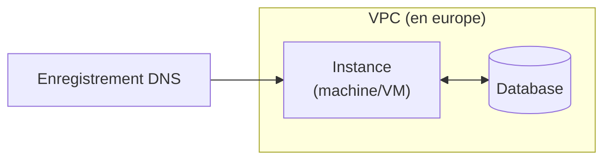

# Provisioner via Terraform

[](https://developer.hashicorp.com/terraform/docs)

Dans ce TD, nous allons mettre en place une infrastructure Cloud via [Terraform](https://developer.hashicorp.com/terraform/docs).

## Rappel sur Terraform

Terraform est un outil d'infrastructure au format code (Infrastructure as Code, IaC) développé par HashiCorp.
Il permet de définir et de provisionner une infrastructure entière en utilisant un langage de configuration simple et lisible par les humains: le HashiCorp Configuration Language (HCL).
Terraform peut être utilisé pour provisionner des infrastructures chez la majorité des fournisseurs Cloud (AWS, Google Cloud Platform, Microsoft Azure, etc..) et peut être aussi utilisé pour **les infrastructures on-premise**.

Via la notion de `state`, Terraform va chercher à définir une description de l'état de l'infrastructure provisonnée.
Chaque `terraform apply` executera de façon impérative des actions pour rapprocher l'état de l'infrastructe (état live) de l'état que vous aurez déclaré dans vos fichiers (état désiré).

## Installation de l'outil

Via [le tutoriel Hashicorp](https://developer.hashicorp.com/terraform/tutorials/aws-get-started/install-cli), installer la CLI (Command Line Interface) de `terraform` suivant le système d'exploitation de votre machine ou votre VM.

### Commandes

Ces commandes principales vous permettrons de manipuler et tester votre state tout au long du TD.

#### Commandes Initiales

| Commandes_terraform |  Description |
| ------------------ | ------------ |
| `terraform init`     | Initialise un répertoire contenant des fichiers de configuration Terraform. Cette commande télécharge les plugins nécessaires pour les fournisseurs d'infrastructure spécifiés dans les configurations.
| `terraform vaidate`  | Vérifie la syntaxe et la validité des fichiers de configuration Terraform dans le répertoire actuel.
| `terraform fmt`      | Formate les fichiers de configuration Terraform selon les conventions standard, améliore la lisibilité et la cohérence.

#### Commandes de Planification et d'Application

| Commandes_terraform |  Description |
| ------------------- | ------------ |
`terraform plan`      | Crée un plan d'exécution, montrant ce que Terraform fera pour atteindre l'état souhaité défini dans les fichiers de configuration. Cela permet de voir les modifications avant de les appliquer.
`terraform apply`     | Applique les modifications nécessaires pour atteindre l'état souhaité de l'infrastructure, tel que défini dans les fichiers de configuration. Il peut utiliser un plan généré précédemment.

> [!CAUTION]
> `terraform apply` : À utiliser avec précaution

#### Commandes liées au `state`


| Commandes_terraform |  Description |
| ------------------- | ------------ |
|`terraform show`     | Affiche des informations sur l'état ou sur le plan généré, montrant l'état actuel des ressources gérées par Terraform.
|`terraform state`    | Gère l'état des ressources. Permet d'effectuer des opérations comme déplacer des ressources, les supprimer de l'état, etc.

> [!note]
> La commande `terraform state` a plusieurs sous-commandes comme `mv`, `rm`, `list`, etc.
> ```shell
> # Lister les resources du state
> terraform state list
> # Supprimer une instance de ressources dans le state
> terraform state rm <resource_type>.<resource_name>
> # Afficher une instance de ressource du state
> terraform state show <resource_type>.<resource_name>
> ```

#### Commandes de Destruction

> [!CAUTION]
> À utiliser avec précaution

| Commandes_terraform |  Description |
| ------------------- | ------------ |
| `terraform destroy` | **Détruit toutes les ressources gérées par la configuration Terraform.** Cela supprime toute l'infrastructure provisionnée.

#### Commandes de Gestion de Modules

| Commandes_terraform |  Description |
| ------------------- | ------------ |
| `terraform get`     | Télécharge et met à jour les modules définis dans les configurations Terraform.
| `terraform output`  | Affiche les valeurs des sorties (outputs) définies dans les configurations Terraform, ce qui peut être utile pour récupérer des informations sur les ressources provisionnées.
| `terraform graph`  |  Génère un graphique des ressources Terraform et de leurs dépendances, ce qui peut être utile pour visualiser la structure de l'infrastructure.

#### Autres commandes utiles

| Commandes_terraform |  Description |
| ------------------- | ------------ |
| `terraform lock` </br> `terraform unlock` | Verrouille ou Déverrouille l'état de Terraform pour prévenir les modifications concurrentes.
| `terraform import`  | Importe une ressource existante dans Terraform. Cela permet de gérer des ressources créées manuellement ou par d'autres moyens.
| `terraform output`  | Affiche les outputs spécifiés, `terraform output -json` affiche tout les outputs de la configuration.

> [!note]
> `terraform import` d'utilise comme ceci
> ```shell
> terraform import '<resource_type>.<resource_name>' <resource_id>
> ```

---

## Manipuler Terraform

Créer dans votre de dépôt de code, dans votre dossier `TD`, un dossier `2_terraform` dans lequel vous placerez les fichiers issues de cet exercice **ainsi qu'un `README.md` contenant les résultats de vos `terraform plan`.**

### En utilisant GCP

Dans un dossier `foundation-gcp`, en utilisant GCP et Terraform, créer une IaC pour mettre en place l'infrastructure suivante.



La relation entre VM et la base de donnée se fera dans l'application, pas de besoin donc de la spécifier dans la IaC.
Les deux resources doivent cependant tout de même faire partie du même VPC, pour pouvoir communiquer.

Utiliser [la documentation du provider](https://registry.terraform.io/providers/hashicorp/google/latest/docs) pour choisir et configurer **au minimum** les ressources :

> [!important]
> A chacune des étapes ci-dessous, la commande `terraform validate` & `terraform plan` doit s'executer sans erreur.
> Une fois toutes les étapes réalisé, copier/coller le résultat du `terraform plan` dans votre `README.md`.

1. Commencer par configurer un VPC (`google_compute_network`).
2. Ajouter ensuite une instance de Compute Engine dans ce VPC (`google_compute_instance`).
3. Également dans ce VPC, ajouter une base de donnée. (`google_sql_database_instance`).
4. Ajouter une entrer DNS (`google_dns_record_set`).
5. Ajouter un meta-argument pour permettre de déployer plusieurs instances de la VM pour atteindre le premier chiffre de la haute disponibilité.

> [!tip]
> `google_dns_record_set` nécessite une `managed_zone` utiliser un DNS de votre choix (ex: `example.com`) ou la ressource `google_dns_managed_zone`.

> [!important]
> Pour pouvoir effectuer le terraform plan, vous aurez besoin d'un compte de service qui à accès au projet GCP `esirem`.
> Une fois la clé JSON de ce compte récupérée et ajoutée au dossier sous le nom `student.json`, ajouter la via l'environnement:
> ```
> export GOOGLE_APPLICATION_CREDENTIALS="./student.json"
> echo "**/student.json" >> .gitignore
> ```
>
> Configurer le provider comme suit:
> ```hcl
> provider "google" {
>     project = var.project_id
>     region  = var.region
> }
> ```

### En utilisant AWS

Dans un second dossier `foundation-aws`, déclarez la même IaC pour un déploiement chez AWS. Vous choisirez les ressources les plus adaptées dans la 

> [!important]
> Pour pouvoir effectuer le terraform plan, vous aurez besoin d'un compte de service qui à accès à l'environment AWS.
> Ajouter les variables `AWS_ACCESS_KEY_ID`, `AWS_SECRET_ACCESS_KEY` et `AWS_REGION` au terminal qui execute les commandes Terraform. 
> ```bash
> export AWS_ACCESS_KEY_ID="access-key-id"
> export AWS_SECRET_ACCESS_KEY="access-key-secret"
> export AWS_REGION="eu-west-3"
> ```

> [!WARNING]
> La commande `terraform validate` & `terraform plan` doit s'executer sans erreur. Le résultat du `terraform plan` est à ajouter au `README.md`

## Créer un module pour chacun des deux providers 🚀

On ne va tout de même pas réecrire tout ça pour chacune de nos applications ! 

---

Liens utiles: 
- Documentation [Terraform](https://developer.hashicorp.com/terraform?product_intent=terraform)
- Documentation Terraform: [Google provider](https://registry.terraform.io/providers/hashicorp/google/latest/docs)
- Documentation Terraform: [AWS provider](https://registry.terraform.io/providers/hashicorp/aws/latest/docs)
