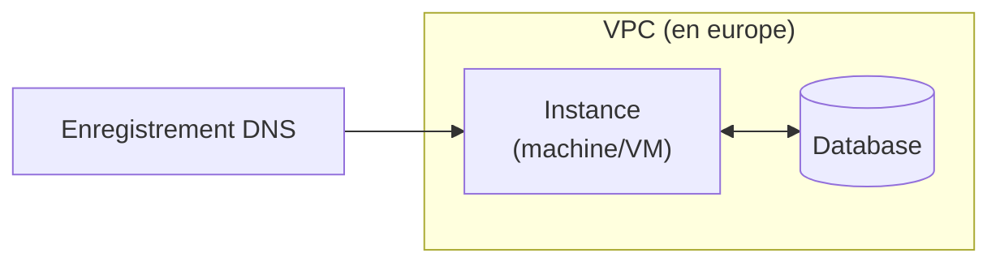

# Provisioner via Terraform

[[](https://img.shields.io/badge/terraform-%235835CC.svg?style=for-the-badge&logo=terraform&logoColor=white)](https://developer.hashicorp.com/terraform/docs)

Dans ce TD, nous allons mettre en place une infrastructure Cloud via [Terraform](https://developer.hashicorp.com/terraform/docs).

## Rappel sur Terraform

Terraform est un outil d'infrastructure au format code (Infrastructure as Code, IaC) développé par HashiCorp.
Il permet de définir et de provisionner une infrastructure entière en utilisant un langage de configuration simple et lisible par les humains: le HashiCorp Configuration Language (HCL).
Terraform peut être utilisé pour provisionner des infrastructures chez la majorité des fournisseurs Cloud (AWS, Google Cloud Platform, Microsoft Azure, etc..) et peut être aussi utilisé pour **les infrastructures on-premise**.

Via la notion de `state`, Terraform va chercher à définir une description de l'état de l'infrastructure provisonnée.
Chaque `terraform apply` executera de façon impérative des actions pour rapprocher l'état de l'infrastructe (état live) de l'état que vous aurez déclaré dans vos fichiers (état désiré).

## Installation de l'outil

Via [le tutoriel Hashicorp](https://developer.hashicorp.com/terraform/tutorials/aws-get-started/install-cli), installer la CLI (Command Line Interface) de `terraform` suivant le système d'exploitation de votre machine ou votre VM.

### Commandes

Ces commandes principales vous permettrons de manipuler et tester votre state tout au long du TD.

#### Commandes Initiales

##### terraform init

**Description** : Initialise un répertoire contenant des fichiers de configuration Terraform. Cette commande télécharge les plugins nécessaires pour les fournisseurs d'infrastructure spécifiés dans les configurations.

**Usage** : `terraform init`

##### terraform validate

**Description** : Vérifie la syntaxe et la validité des fichiers de configuration Terraform dans le répertoire actuel.

**Usage** : `terraform vaidate`

##### terraform fmt

**Description** : Formate les fichiers de configuration Terraform selon les conventions standard, améliore la lisibilité et la cohérence.

**Usage** : `terraform fmt`

#### Commandes de Planification et d'Application

##### terraform plan :

**Description** : Crée un plan d'exécution, montrant ce que Terraform fera pour atteindre l'état souhaité défini dans les fichiers de configuration. Cela permet de voir les modifications avant de les appliquer.
**Usage** : `terraform plan`

##### terraform apply

> [!CAUTION]
> À utiliser avec précaution

**Description** : Applique les modifications nécessaires pour atteindre l'état souhaité de l'infrastructure, tel que défini dans les fichiers de configuration. Il peut utiliser un plan généré précédemment.
**Usage** : `terraform apply`

#### Commandes d'État

##### terraform show

**Description** : Affiche des informations sur l'état ou sur le plan généré, montrant l'état actuel des ressources gérées par Terraform.
**Usage** : `terraform show`

##### terraform state

**Description** : Gère l'état des ressources. Permet d'effectuer des opérations comme déplacer des ressources, les supprimer de l'état, etc.

**Usage** : `terraform state` (cette commande a plusieurs sous-commandes comme `mv`, `rm`, `list`, etc.)

```shell
# Lister les resources du state
terraform state list
# Supprimer une instance de ressources dans le state
terraform state rm <resource_type>.<resource_name>
# Afficher une instance de ressource du state
terraform state show <resource_type>.<resource_name>
```

#### Commandes de Destruction ( à utiliser avec précaution )

##### terraform destroy

> [!CAUTION]
> À utiliser avec précaution

**Description** : **Détruit toutes les ressources gérées par les configurations Terraform.** Cela supprime toute l'infrastructure provisionnée.

**Usage** : `terraform destroy`

#### Commandes de Gestion de Modules

##### terraform get

**Description** : Télécharge et met à jour les modules définis dans les configurations Terraform.

**Usage** : `terraform get`

##### terraform output

**Description** : Affiche les valeurs des sorties (outputs) définies dans les configurations Terraform, ce qui peut être utile pour récupérer des informations sur les ressources provisionnées.

**Usage** : `terraform output`

##### terraform graph

**Description** : Génère un graphique des ressources Terraform et de leurs dépendances, ce qui peut être utile pour visualiser la structure de l'infrastructure.

**Usage** : `terraform graph`

#### Autres commandes utiles

##### terraform lock et terraform unlock

**Description** : terraform lock verrouille l'état de Terraform pour prévenir les modifications concurrentes, et terraform unlock déverrouille cet état.

**Usage** :
```shell
# Verrouiller
terraform lock
# Déverrouiller
terraform unlock
```

##### terraform import

**Description** : Importe une ressource existante dans Terraform. Cela permet de gérer des ressources créées manuellement ou par d'autres moyens.

**Usage** : 
```shell
terraform import <resource_type>.<resource_name> <resource_id>
```
## Manipuler Terraform

Créer dans votre de dépôt de code, dans votre dossier `TD`, un dossier `2_terraform` dans lequel vous placerez les fichiers issues de cet exercice **ainsi qu'un `README.md` contenant les résultats de vos `terraform plan`.**

> [!TIP]
> Utilisez des blocs de code hcl pour la lisibilité.

### En utilisant GCP

Dans un dossier `foundation-gcp`, en utilisant GCP et Terraform, créer une IaC pour mettre en place l'infrastructure suivante.



> [!IMPORTANT]
> La commande `terraform validate` & `terraform plan` doit s'executer sans erreur. Le résultat du `terraform plan` est à ajouter au `README.md`

### En utilisant AWS

Dans un second dossier `foundation-aws`, déclarez la même IaC pour un déploiement chez AWS.

> [!IMPORTANT]
> La commande `terraform validate` & `terraform plan` doit s'executer sans erreur. Le résultat du `terraform plan` est à ajouter au `README.md`

--- 

Liens utiles: 
- Documentation [Terraform](https://developer.hashicorp.com/terraform?product_intent=terraform)
- Documentation Terraform: [Google provider](https://registry.terraform.io/providers/hashicorp/google/latest)
- Documentation Terraform: [AWS provider](https://registry.terraform.io/providers/hashicorp/aws/latest)