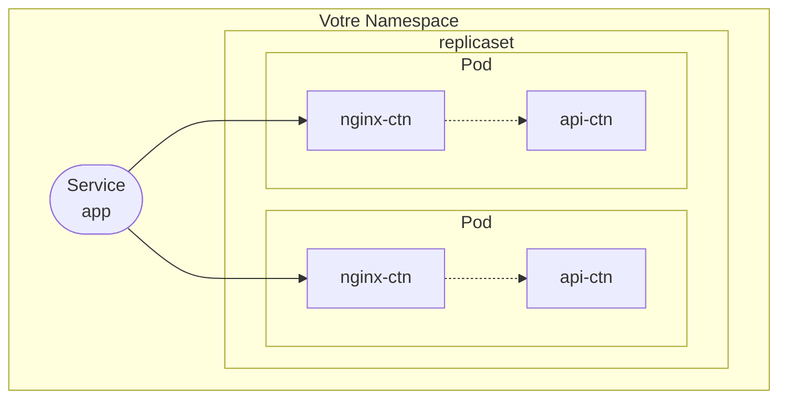

# Kubernetes


C'est le Linux des systèmes distribués et nous allons voir ensemble comment déployer des charges de travail sur un tel environnement.

## Installation de kubectl

Pour piloter **Kubernetes**, nous allons utiliser `kubectl`.

Dans un premier temps, [Installer `kubectl`](https://kubernetes.io/docs/tasks/tools/) via le tutoriel dédié https://kubernetes.io/docs/tasks/tools/install-kubectl-linux/ et suivez les instructions correspondant à votre système d'exploitation.

Pour valider que l'installation fonctionne, utiliser `kubectl` via la commande `kubectl version --client`, qui doit vous retourner quelque chose comme ça :

```shell
Client Version: v1.31.1
Kustomize Version: v5.4.2
```

### Connexion au cluster

Un cluster Kubernetes a été mis en place pour les TDs. Utiliser le fichier fourni pour vous y connecter. *(cf. le tableau)*

> [!caution]
> Merci de ne pas partager le fichier qui permet la connexion au cluster sur internet.

**Copiez** le contenu du fichier et ouvrez votre terminal pour configurer l'accès.

1. Rendez-vous dans votre `HOME`

  ```shell
  cd
  ```

2. Créer un dossier `.kube` et créer dans ce dossier un fichier `config` avec votre éditeur préféré.

  ```shell
  mkdir .kube && vim .kube/config
  ```

3. **Coller** le contenu du fichier dans ce `config` et sauvegarder le fichier.

    > *`Esc` + `:wq` pour quitter `vim` en sauvegardant le fichier*

4. Vérifier le fichier et son contenu :

   ```shell
    ls -la .kube
    cat .kube/config
   ```

> [!note]
> Le fichier que vous venez de créer contient la configuration (adresse + identifiants) pour se connecter à un cluster GKE ([Google Kubernetes Engine](https://cloud.google.com/kubernetes-engine?hl=fr)).
> Nous le mettons dans ce dossier car c'est l'emplacement par défaut où `kubectl` va aller récuperer sa configuration.
>
> *Alternative :* On peut également passer un fichier `config` à `kubectl` directement via l'option `--kubeconfig`.

### Se créer un espace sur le cluster

**Bienvenu sur un cluster Kubernetes !** Faites une première commande pour lister les `namespaces` (espace de nom) :

```shell
kubectl get namespace
```

Pour les TPs qui vont suivre, nous allons nous créer des espaces chacun d'entre vous.

1. Créer un namespace à votre nom. *( deux si vous êtes en binôme )*

```shell
kubectl create namespace <prenom>
```

2. Lister la ressource `namespace`.

```shell
kubectl get ns
kubectl get ns <prenom>
kubectl describe ns <prenom>
kubectl get ns <prenom> -o yaml
```

3. Exécuter la commande suivante pour definir votre `namespace` comme espace de nom par défaut.

  ```shell
  kubectl config set-context --current --namespace=<prenom>
  ```

Désormais si vous exécutez une commande `kubectl`, celle-ci sera exécutée par défaut dans votre namespace !

> [!tip]
> Vous pouvez toujours naviguer entre les espaces de nom via l'option `-n`, disponible avec toutes les commandes `kubectl`.

## Déclarer des charges de travail dans Kubernetes

### Une charge de travail = un Pod

À partir de la définition vue en cours et de la documentation de [Kubernetes sur la ressource Pod](https://kubernetes.io/docs/concepts/workloads/pods/), créer un pod dans votre namespace.

> [!note]
> **Rappel** - L'image a déployer est `gcr.io/kuar-demo/kuard-amd64:blue` qui répond au requête sur le port `8080` (et non `80` comme nginx)

Voici un template pour vous aider :

```yaml
apiVersion: v1
kind: Pod
metadata:
  name: <nom-du-ctn>
spec:
  containers:
  - image: <image>
    name: <nom-du-ctn>
    ports:
    - containerPort: <port>
      name: http
      protocol: TCP
```

Une fois le fichier `pod.yaml` créé, appliquez-le au cluster au cluster via la commande :

```shell
kubectl apply -f pod.yaml
```

Verifier que le pod s'exécute :

```shell
kubectl get pod
kubectl describe pod
```

**Comment y accéder au conteneur dans le Pod?**

Avant d'utiliser une ressource de type `Service`, nous allons utiliser un tunnel HTTP via la commande `kubectl port-forward` (cf. [Documentation](https://kubernetes.io/docs/tasks/access-application-cluster/port-forward-access-application-cluster/)).

Cette commande va permettre de créer un tunnel entre votre machine et le port du conteneur, dans le Pod au sein du cluster.
Voici comment se présente la commande :

```shell
kubectl port-forward <nom-du-pod> <port-hôte>:<port-conteneur>
```

Laisser la commande s'exécuter et dans votre navigateur préféré, rendez-vous sur [http://localhost:<port-hôte>](http://localhost:<port-hôte>).

**À partir de la documentation et de vos tests, schématisez la communication entre votre navigateur et l'application.**

### Déploiement

Nous allons standardiser notre charge de travail dans une déploiement. Il va permettre à la charge de travail de redémarrer en cas d'échec ou de suppression.

> [!note]
> Le [Kubernetes ReplicaSet](https://kubernetes.io/docs/concepts/workloads/controllers/replicaset/) est un controlleur de haut niveau qui permet de manipuler des Pods (Charge de travail).

Créer un déploiement du pod précédent en vous basant sur la [documentation](https://kubernetes.io/docs/concepts/workloads/controllers/replicaset/) et le template suivant.

```yaml
apiVersion: apps/v1
kind: ReplicaSet
metadata:
  labels:
    app: frontend
    soft: nginx
  name: <nom-du-replicaset>
spec:
  replicas: 1                     # Nombre d'instance de la charge de travail à déployer
  selector:
    matchLabels:
      app: frontend
      soft: nginx
  template:                       # template: à partir de là, les attributs qui suivent seront ceux du Pod qui va être créé
    metadata:
      labels:
        app: frontend
        soft: nginx
    spec:
      containers:
      - image: <image>
        name: <nom-du-ctn>
        ports:
        - name: http
          containerPort: <port>
          protocol: TCP
```

Sauvegarder le manifeste dans un fichier `replicaset.yaml` et appliquez le au cluster (via `kubectl apply -f`).

Observer le déploiement et la charge de travail déployée par ce déploiement:

```shell
# Observer le replicaset
kubectl get replicaset
kubectl describe replicaset

# Observer les pods
kubectl get pod
kubectl describe pod <nom-du-pod>
```

Nous allons maintenant supprimer le pod déployé.

```shell
kubectl delete pod <nom-du-pod>
```

**Que pouvez-vous observer ?**

### Service

Nous allons attribuer une IP virtuelle stable & commune pour les charges de travail de ce déploiement. Pour cela, nous allons déclarer la ressource [Kubernetes Service](https://kubernetes.io/fr/docs/concepts/services-networking/service/) en exposant le déploiement créé précédemment.

```shell
kubectl expose replicaset <nom-du-replicaset>
```

Observer le service.

```shell
kubectl get service
kubectl describe service <nom-du-service>
```

#### Pourquoi on a fait ça ?

Le service nous fournis une VIP stable et commune aux pod du déploiement. Quand on augmente le nombre d'instance :

```shell
kubectl scale replicaset <nom-du-replicaset> --replicas 3
kubectl get pod
```

On obtient trois instances jetables, qui peuvent s'arrêter en cas d'échec et donc être amené à changer d'identité et d'**IP**.
Mais grâce au service, le nombre d'instance et le fait qu'elles aient redémarrer ou non importe peu.

Maintenant, réaliser la commande `kubectl port-forward` mais sur le service cette fois :

```shell
kubectl port-forward svc/<nom-du-svc> <port-hôte>:<port-conteneur>
```

Dans votre navigateur préféré, rendez-vous sur [http://localhost:<port-hôte>](http://localhost:<port-hôte>).

**Schématisez dans un nouveau schéma, la communication entre votre navigateur et l'application.**

### Passons aux choses sérieuses


Nous allons écrire le fichier et réaliser les commandes nécéssaire à la réalisation l'architecture suivante :



Pour le namespace, pas d'inquiétude, c'est votre namespace par défault. À partir des templates et commandes vues précédement, réaliser :

Le `replicaset` nommé "app" qui déploie **deux instances** d'une charge de travail (`Pod`) **à deux conteneurs** :

* Le premier conteneur se nomme `nginx-ctn`, exécute l'image `nginx:latest` et est ouvert sur le port `8080`
* Le deuxième conteneur se nomme `api-ctn`, exécute l'image `alpine:latest` et est ouvert sur le port `3000`

Exposer le conteneur nginx du déploiement via la commande :

```shell
kubectl expose replicaset app --target-port=8080
```

**Comment implémenter la relation entre `nginx-ctn` et `api-ctn` ?**

> [!IMPORTANT]
> Concervez ces fichiers dans votre dépôt dans un sous-dossier `kubernetes`

---

## Bonus - Manipuler k8s avec style

Pour faciliter votre utilisation de `kubectl`, vous pouvez :

* Mettre en place l'**alias** `k=kubectl`. *( ça fait quand même gagner 6 lettres à chaque commande ! )*
* **Kubernetes** et `kubectl` par défaut n'ont pas d'interface graphique, mais vous pouvez mettre de la couleur dans votre terminal avec `k9s` ou `kubecolor` !

  &nbsp;&nbsp;&nbsp; &nbsp;&nbsp;&nbsp; &nbsp;&nbsp;&nbsp;&nbsp;&nbsp;&nbsp; &nbsp;&nbsp;&nbsp; &nbsp;&nbsp;&nbsp; &nbsp;&nbsp;&nbsp; &nbsp;&nbsp;&nbsp; &nbsp;&nbsp;&nbsp; &nbsp;&nbsp;&nbsp; &nbsp;&nbsp;&nbsp; &nbsp;&nbsp;&nbsp; &nbsp;&nbsp;&nbsp; &nbsp;&nbsp;&nbsp; &nbsp;&nbsp;&nbsp; &nbsp;&nbsp;&nbsp; &nbsp;&nbsp;&nbsp; &nbsp;&nbsp;&nbsp;  [🔴 Installer `k9s`](https://k9scli.io/topics/install/) &nbsp;&nbsp;&nbsp; &nbsp;&nbsp;&nbsp; &nbsp;&nbsp;&nbsp; &nbsp;&nbsp;&nbsp; &nbsp;&nbsp;&nbsp; &nbsp;&nbsp;&nbsp; [🔵 Installer `kubecolor`](https://kubecolor.github.io/setup/install/)

---

##### Liens utiles

* [Kubernetes](https://kubernetes.io/docs/home/)
* [Kubernetes Pod](https://kubernetes.io/docs/concepts/workloads/pods/)
* [Kubernetes Service](https://kubernetes.io/fr/docs/concepts/services-networking/service/)
* [Kubernetes ReplicaSet](https://kubernetes.io/docs/concepts/workloads/controllers/replicaset/)
* [Kubernetes Namespace](https://kubernetes.io/docs/concepts/overview/working-with-objects/namespaces/)
* [kubectl Cheat Sheet](https://kubernetes.io/fr/docs/reference/kubectl/cheatsheet/)
* [Excalidraw](https://excalidraw.com/) & [Draw.io](https://draw.io/) pour les schémas. *(ou directement dans le readme via `mermaid` si vous êtes chaud)*
