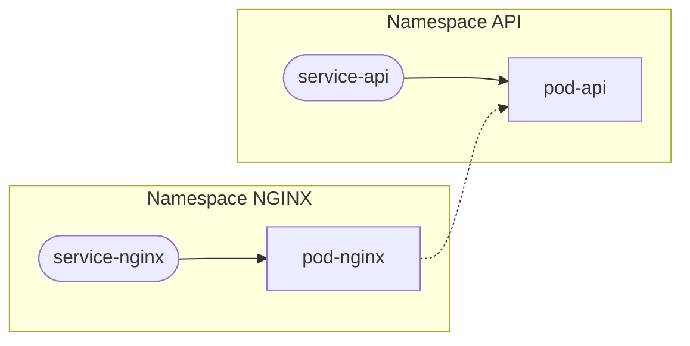
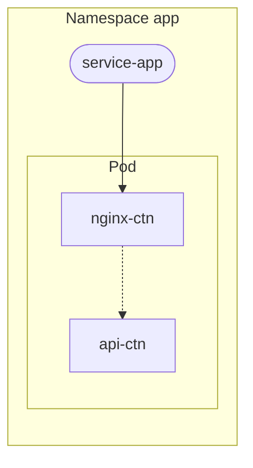

# Kubernetes

## Environnement

Un cluster Kubernetes a été mis en place pour le projet.

Utilisez le fichier fourni pour vous y connecter 

Rappel des commande kubectl 

## Exercice 1

En utilisant les fichiers suivant construisez une application simple

kubectl port-forward

## Exercice 2 

Ecrire les fichiers pour l'application suivante

> [!IMPORTANT]
> Concervez ces fichiers dans votre dépôt dans un dossier `TD/kubernetes`

## Exercice 

